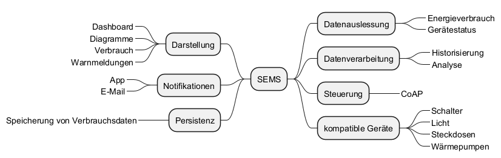

# Produktdokumentation Abs. 1: Einleitung

## 1. Abstract: Ziel & Zweck des Produktes
SEMS ist eine zentrale Software-Applikation zur Aggregation und Verarbeitung von
Smart-Home-Gerätedaten. Das System verwendet eine geschichtete Architektur.

Die Anbindung der Hardwarekomponenten erfolgt über das Kommunikationsprotokoll
CoAP (Constrained Application Protocol) zur Erfassung von Gerätedaten.
Diese Daten werden anschließend in einem dedizierten Systembereich prozessiert
und zur schnellen Verfügbarkeit persistent gespeichert.

Die Applikation stellt die gesammelten Informationen sowie den Systemstatus
für den Nutzer visuell dar. Das System unterstützt die Betriebssysteme
iOS und Android.

---

## 2. Produktbeschreibung und Zielgruppe
### Produktbeschreibung
Das System basiert auf einer logischen 4-Schichten-Architektur, die
eine klare Trennung von Verantwortlichkeiten gewährlseitet

##### Geräteschicht
**Komponenten:** Smart-Steckdosen, Sensoren, Aktoren
**Aufgabe:** Kontinuierliche Datenerfassung (z.B. Energieverbrauch) und
Bereitstellung von Steuerbefehlen
**Schlüsselprotokolle:** CoAP

##### Kommunikations- und Logikschicht (Backend)
Diese Schicht wird primär durch den Raspberry Pi 5 gehostet und umfasst die
Backend-Logik.
**Gateway-Modul:** Empfängt die Rohdaten, führt die Protokollübersetzung und
eine initiale Datenvalidierung durch

**Daten-Verarbeitungs-Modul:** Führt die Transformation der Rohdaten durch,
z.B Aggregation (Zusammenfassung von Sekundenwerten zu Minuten- oder Stundenwerte)
und Normalisierung

**Persistenz-Logik-Modul (Business Logic):** Das Herz des SEMS. Es implementiert die Geschäftsregeln:
- Historisierung: Übergibt die verarbeiteten Daten zur Speicherung an die Datenbank
- Regel-Engine: Überwacht die aktuellen Verbrauchsdaten gegen konfigurierte Schwellenwerte
- Benachrichtigungsdienst: Generiert Warnmeldungen (z.B. bei Überschreitung dse Maximalverbrauchs)
und sendet diese zur Zustellung an die Präsentationsschicht

##### Persistenzschicht
**Komponente:** Datenbank
**Augabe:** Langfristige Speicherung der Verbrauchswerte und der Metadaten (Geräte-IDs,
Benutzerkonfigurationen, Schwellenwerte)

##### Präsentationschicht
**Architekturmuster:** Die Darstellung folgt dem MVC- Muster
**Komponenten:** Backend-API (Controller): Bietet RESTful Schnittstellen 
(z.B. GET /dashboard/data, PUT /device/settings) für die App-Clients
**Dashboard / App (View):** Die eigentliche Benutzeroberfläche auf dem Smartphone.
Visualisiert die Daten graphisch und analytisch dar und nimmt Benutzereingaben entgegen.

### Zielgruppe
- Smart-Home Nutzer: Haushalte, die mehrere Geräte für z.B. Licht, Heizung und Sicherheit
besitzen und eine zentrale Setuerungsplatform suchen.
- Energiebewusste Haushalte: Nutzer, die aktiv Kosten senken und ihren Stromverbrauch detaillierter analysieren wollen.

---

## 3. Zentrale funktionalen Eigenschaften erläutert an der Mind-Map

---

## 4. Umsetzung des Produktes anhand von Mock-Ups
[UI-Mock-Up](https://pr.to/BWKL91/)

